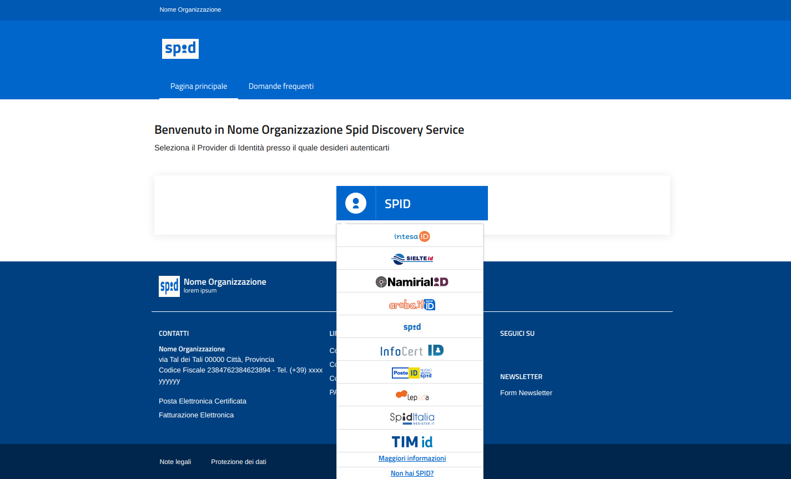
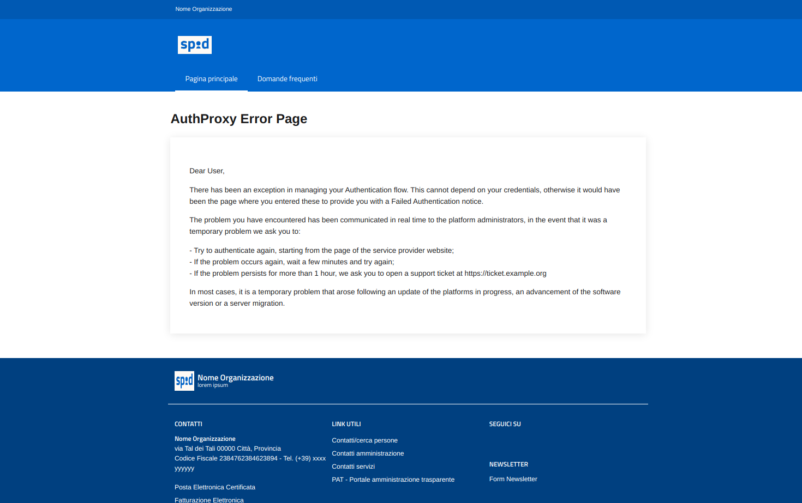
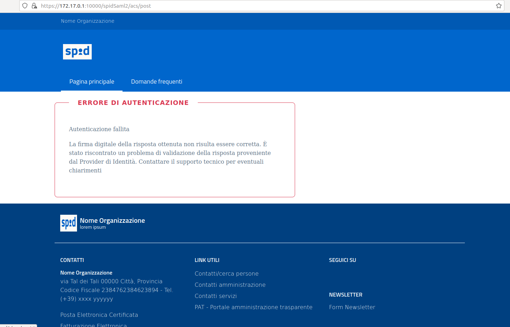
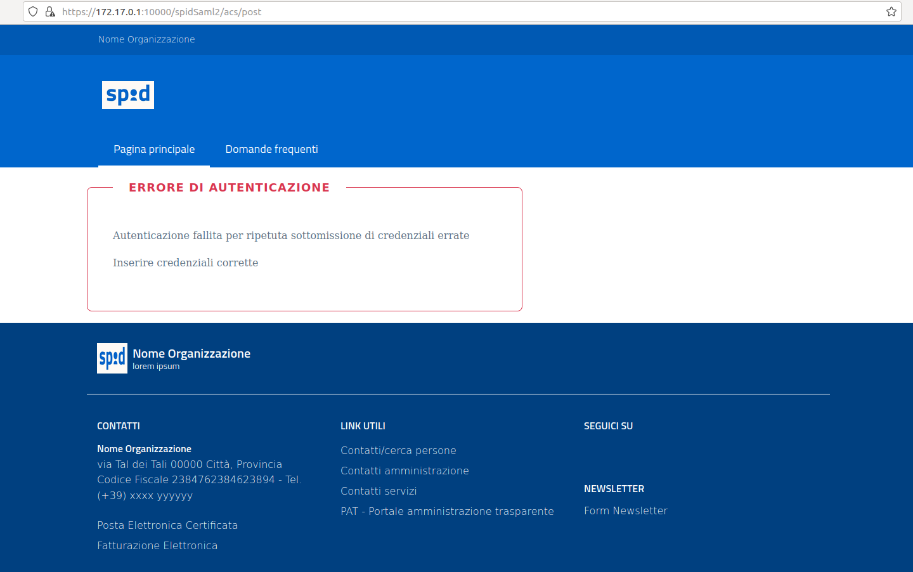

# Satosa-Saml2Spid

This is a SAML2  configuration for [SATOSA](https://github.com/IdentityPython/SATOSA)
that aims to setup a **SAML-to-SAML Proxy** compatible with the  **SPID - the Italian Digital Identity System**.

## Table of Contents
1. [Goal](#goal)
2. [Demo components](#demo-components)
3. [Docker image](#docker-image)
4. [Setup](#setup)
5. [Start the Proxy](#start-the-proxy)
6. [Additional technical informations](#additional-technical-informations)
7. [Author](#author)
8. [Credits](#credits)


## Goal

Satosa-Saml2 Spid is an intermediary between many SAML2 Service Providers and many SAML2 Identity Providers.
Specifically it allows traditional Saml2 Service Providers to communicate with
**Spid Identity Providers** adapting Metadata and AuthnRequest operations to the Spid technical requirements.


**Figure1** : _Common scenario, a traditional SAML2 Service Provider (SP) that's proxied through the SATOSA SPID Backend gets compliances on AuthnRequest and Metadata operations_.

More generally this solution allows us to adopt multiple proxy _frontends_ and _backends_
to adapt and allows to communicate systems that, due to protocol or specific
limitations, traditionally could not interact each other.

**Short glossary**

- **Frontend**, interface of the proxy that is configured as a SAML2 Identity Provider
- **Backend**, interface of the proxy that is configured as a SAML2 Service Provider
- **TargetRouting**, a SATOSA microservice for selecting the output backend to reach the endpoint (IdP) selected by the user
- **Discovery Service**, interface that allows users to select the authentication endpoint


## Demo components

The example project comes with the following demo pages, served
with the help of an additional webserver dedicated for static contents:


###### Discovery Service page



###### Generic error page



###### Saml2 Signature Error page



###### AgID SPID test #104



You can find these demo pages in `example/static` and edit at your taste.
To get redirection to these pages, or redirection to third-party services, consider the following configuration files:

- `example/proxy_conf.yml`, example: `UNKNOW_ERROR_REDIRECT_PAGE: "https://localhost:9999/error_page.html"`
- `example/plugins/{backends,frontends}/$filename`, example: `disco_srv: "https://localhost:9999/static/disco.html"`


## Docker image

You should [customize the configuration](https://github.com/peppelinux/Satosa-Saml2Spid#configure-the-proxy) before creating a Docker image, if you want to
run a demo anyway, you can use the example project as well with some compromise. Start your demo SP and your
demo IdP (Example IdPs: [spid-saml-check](https://github.com/italia/spid-saml-check) or [spid-test-env2](https://github.com/italia/spid-testenv2)) then
use their **metadata URLs** in the build command, as follow:

````
docker image build --tag saml2spid . --build-arg SP_METADATA_URL="http://localhost:8000/saml2/metadata" --build-arg IDP_METADATA_URL="http://localhost:8080/metadata.xml"
docker run -t -i -p 10000:10000 -p 9999:9999 saml2spid
````

Copy proxy frontend metadata to your SP:
````
wget https://localhost:10000/Saml2IDP/metadata -O saml2_sp/saml2_config/satosa-spid.xml --no-check-certificate
````

Copy proxy backend metadata to your IdPs:
````
https://localhost:10000/spidSaml2/metadata
https://localhost:10000/Saml2/metadata
````

Enter in the container for inspection ... it could be useful
````
docker exec -it $(docker container ls | grep saml2spid | awk -F' ' {'print $1'}) /bin/sh
````

Remember to edit and customize all the values like `"CHANGE_ME!"` in the configuration files, in `proxy_conf.yaml` and in plugins configurations.


## Setup

###### Prepare environment
````
mkdir satosa_proxy && cd satosa_proxy
virtualenv -ppython3 satosa.env
source satosa.env/bin/activate
````

###### Dependencies
````
sudo apt install -y libffi-dev libssl-dev xmlsec1 python3-pip xmlsec1 procps libpcre3 libpcre3-dev

git clone https://github.com/peppelinux/Satosa-Saml2Spid.git repository
pip install -r repository/requirements.txt
````

## Configure the Proxy

Create certificates for SAML2 operations, see [psmiraglia](https://github.com/italia/spid-compliant-certificates).
````
export WD="pki/"

mkdir $WD && cd $WD
cp ../repository/oids.conf .
cp ../repository/build_spid_certs.sh .

# create your values inline
cat > my.env <<EOF
export COMMON_NAME="SPID example proxy"
export LOCALITY_NAME="Roma"
export ORGANIZATION_IDENTIFIER="PA:IT-c_h501"
export ORGANIZATION_NAME="SPID example proxy"
export SERIAL_NUMBER="1234567890"
export SPID_SECTOR="public"
export URI="https://spid.proxy.example.org"
export DAYS="7300"
EOF

. my.env

bash build_spid_certs.sh
cd ..
````

Copy `repository/example/*` contents (`cp -R repository/example/* .`) and **edit the following files** with your preferred configuration.
These are the configuration files:

- `example/proxy_conf.yaml`
- `example/plugins/backends/spidsaml2_backend.yaml`
- `example/plugins/backends/saml2_backend.yaml`
- `example/plugins/frontend/saml2_frontend.yaml`


## Saml2 Metadata

If you want to handle metadata file manually, as this example purpose as demostration,
create `metadata/idp` and `metadata/sp` folders, then copy metadata:

````
mkdir -p metadata/idp metadata/sp
wget https://localhost:8080/metadata.xml -O metadata/idp/spid-saml-check.xml
wget https://registry.spid.gov.it/metadata/idp/spid-entities-idps.xml -O metadata/idp/spid-entities-idps.xml
````

Copy your SP metadata to your Proxy
````
wget https://sp.fqdn.org/saml2/metadata -O metadata/sp/my-sp.xml
````

Otherwise the best method would be enabling a MDQ server in each frontend and backend configuration file.
See `example/plugins/{backends,frontends}/$filename` as example.


## Start the Proxy

**Warning**: these examples must be intended only for test purpose, for a demo run. Please remember that the following examples wouldn't be intended for a real production environment! If you need some example for a production environment please take a look at `example/uwsgi_setup/` folder.

````
export SATOSA_APP=$VIRTUAL_ENV/lib/$(python -c 'import sys; print(f"python{sys.version_info.major}.{sys.version_info.minor}")')/site-packages/satosa

# only https with satosa, because its Cookie only if "secure" would be sent
uwsgi --wsgi-file $SATOSA_APP/wsgi.py  --https 0.0.0.0:10000,./pki/cert.pem,./pki/privkey.pem --callable app -b 32768

# additional static serve for the demo Discovery Service with Spid button
uwsgi --https 0.0.0.0:9999,./pki/cert.pem,./pki/privkey.pem --check-static-docroot --check-static ./static/ --static-index disco.html
````

#### Get Proxy Metadata for your SP

The Proxy metadata must be configured in your SP. Your SP is an entity that's external from this Proxy, eg: shibboleth sp, djangosaml2, another ...
````
wget https://localhost:10000/Saml2IDP/metadata -O path/to/your/sp/metadata/satosa-spid.xml --no-check-certificate
````

Then start an authentication from your SP.


**Figure 2**: The result using spid-saml-check.

## Hints

If you're doing tests and you don't want to pass by Discovery page each time you can use idphinting but only if your SP support it!
Here an example using djangosaml2 as SP:

`http://localhost:8000/saml2/login/?idp=https://localhost:10000/Saml2IDP/metadata&next=/saml2/echo_attributes&idphint=https%253A%252F%252Flocalhost%253A8080`


## Trouble shooting

That's the stdout log of a working instance of SATOSA in uwsgi

````
*** Starting uWSGI 2.0.19.1 (64bit) on [Tue Mar 30 17:08:49 2021] ***
compiled with version: 9.3.0 on 11 September 2020 23:11:42
os: Linux-5.4.0-70-generic #78-Ubuntu SMP Fri Mar 19 13:29:52 UTC 2021
nodename: wert-desktop
machine: x86_64
clock source: unix
pcre jit disabled
detected number of CPU cores: 8
current working directory: /path/to/IdentityPython/satosa_proxy
detected binary path: /path/to/IdentityPython/satosa_proxy/satosa.env/bin/uwsgi
your processes number limit is 62315
your memory page size is 4096 bytes
detected max file descriptor number: 1024
lock engine: pthread robust mutexes
uWSGI http bound on 0.0.0.0:10000 fd 4
spawned uWSGI http 1 (pid: 28676)
uwsgi socket 0 bound to TCP address 127.0.0.1:39553 (port auto-assigned) fd 3
Python version: 3.8.5 (default, Jan 27 2021, 15:41:15)  [GCC 9.3.0]
Python main interpreter initialized at 0x55f744576790
your server socket listen backlog is limited to 100 connections
your mercy for graceful operations on workers is 60 seconds
mapped 72920 bytes (71 KB) for 1 cores
*** Operational MODE: single process ***
[2021-03-30 17:08:50] [INFO ]: Running SATOSA version 7.0.1 [satosa.proxy_server.make_app:165]
[2021-03-30 17:08:50] [INFO ]: Loading backend modules... [satosa.base.__init__:42]
[2021-03-30 17:08:51] [INFO ]: Setup backends: ['Saml2', 'spidSaml2'] [satosa.plugin_loader.load_backends:49]
[2021-03-30 17:08:51] [INFO ]: Loading frontend modules... [satosa.base.__init__:45]
[2021-03-30 17:08:51] [INFO ]: Setup frontends: ['Saml2IDP'] [satosa.plugin_loader.load_frontends:70]
[2021-03-30 17:08:51] [INFO ]: Loading micro services... [satosa.base.__init__:51]
[2021-03-30 17:08:51] [INFO ]: Loaded request micro services: ['DecideBackendByTarget'] [satosa.plugin_loader.load_request_microservices:260]
[2021-03-30 17:08:51] [INFO ]: Loaded response micro services:[] [satosa.plugin_loader.load_response_microservices:281]
WSGI app 0 (mountpoint='') ready in 2 seconds on interpreter 0x55f744576790 pid: 28675 (default app)
*** uWSGI is running in multiple interpreter mode ***
spawned uWSGI worker 1 (and the only) (pid: 28675, cores: 8)
````


## Additional technical informations for Developers

#### SPID technical Requirements

The SaToSa **SPID** backend contained in this project adopt specialized forks of pySAML2 and SATOSA, that implements the following patches,
read [this](README.idpy.forks.mngmnt.md) for any further explaination about how to patch by hands.

All the patches and features are currently merged and available with the following releases:
- [pysaml2](https://github.com/peppelinux/pysaml2/tree/pplnx-v7.0.1)
- [SATOSA](https://github.com/peppelinux/SATOSA/tree/pplnx-v7.0.3)


#### Pending contributions to idpy

These are mandatory only for getting Spid SAML2 working, these are not needed for any other traditional SAML2 deployment:

- [Micro Service - Decide backend by target entity ID](https://github.com/IdentityPython/SATOSA/pull/220)
  This is a work in progress that works as it is!
- [date_xsd_type](https://github.com/IdentityPython/pysaml2/pull/602/files)
- [disabled_weak_algs](https://github.com/IdentityPython/pysaml2/pull/628)
- [ns_prefixes](https://github.com/IdentityPython/pysaml2/pull/625)
- [SATOSA unknow error handling](https://github.com/IdentityPython/SATOSA/pull/324)
- [SATOSA redirect page on error](https://github.com/IdentityPython/SATOSA/pull/325)


#### Warnings
Here something that you should know before start.

- You must enable more than a single IdP (multiple metadata or single metadata with multiple entities) to get *Discovery Service* working.
- Proxy doesn't handle SAML2 SLO, so the spidSaml2 backend is configured with Authnforce -> True. For any further information see [Single Logout in Satosa](https://github.com/IdentityPython/SATOSA/issues/211).
- SATOSA Saml2 backend configuration have a **policy** section that will let us to define specialized behaviours
  and configuration for each SP (each by entityid). In this example I defined a single "default" behaviour with attributes **name_format**
  to **urn:oasis:names:tc:SAML:2.0:attrname-format:uri**, due to my needs to handle many service providers for which it could be painfull do a static definition each time.
  An additional "hack" have been made in `example/attributes-maps/satosa_spid_uri_hybrid.py`, where I adopted a hybrid mapping that works for
  both *URI* and *BASIC* formats. Feel free to customized or decouple these format in different files and per SP.


## References

SATOSA Official Documentation is available at the following links, make sure you've taken a
look to these to understand the potential of this platform:
- [SaToSa Saml2Saml Documentation](https://github.com/IdentityPython/SATOSA/blob/master/doc/one-to-many.md)
- [Use cases](https://github.com/IdentityPython/SATOSA/wiki#use-cases)


Account Linking

- [pyMultiLDAP SaToSa MS](https://github.com/peppelinux/pyMultiLDAP/tree/master/multildap/satosa)
- Attributes Processing with [SATOSA-uniext](https://github.com/UniversitaDellaCalabria/SATOSA-uniExt/blob/master/satosa_uniext/processors/unical_attribute_processor.py)


Additional resources:

- [satosa-eidas-ansible](https://github.com/grnet/satosa-eidas-ansible)
- [aws-saml-proxy](https://github.com/senorkrabs/aws-saml-proxy)
- [satosa-oidc-to-sam](https://github.com/daserzw/satosa-oidc-to-saml)
- [SaToSa training aarc project](https://aarc-project.eu/wp-content/uploads/2019/03/SaToSa_Training.pdf)
- [IDP/SP Discovery service](https://medium.com/@sagarag/reloading-saml-idp-discovery-693b6bff45f0)
- https://github.com/IdentityPython/SATOSA/blob/master/doc/README.md#frontend
- [saml2.0 IdP and SP for tests](https://samltest.id/)
- https://www.spid.gov.it/assets/download/SPID_QAD.pdf

## Author

Giuseppe De Marco


## Credits

- Andrea Ranaldi and his Team in ISPRA Ambiente
- Fulvio Scorza and his Team in Università del Piemonte Orientale
- Paolo Smiraglia (SPID certs)
- idpy Community  (pySAML2 and SATOSA)
