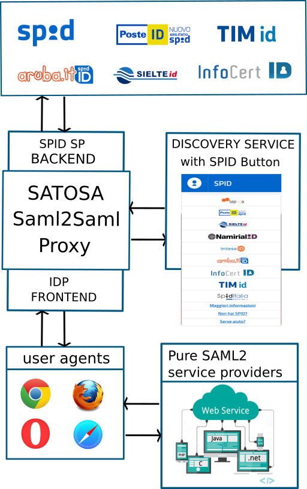

# Satosa-saml2saml
An example configuration to deploy SATOSA SAML-to-SAML one-to-many proxy with an Additional SAML2 backed for SPID (Italian Digital Identity System).

Official docs:
- [SaToSa Saml2Saml Documentation](https://github.com/IdentityPython/SATOSA/blob/master/doc/one-to-many.md)
- [Use cases](https://github.com/IdentityPython/SATOSA/wiki#use-cases)

--------------------------------------



**Figure1** : _Common scenario, many pure SAML2 Service Providers (SP) being proxied through the SATOSA SPID Backend, having compliances on AuthnRequest and Metadata operations_


## Requirements

The SaToSa SPID example contained in this project works if the following patches will be used, 
read [this](README.idpy.forks.mngmnt.md) for any further explaination about how to patch by yourself.


#### SPID

These are mandatory only for getting SPID SAML2 working:

- [[Micro Service] Decide backend by target entity ID](https://github.com/IdentityPython/SATOSA/pull/220)
  This is a work in progress that works as it is!
- [date_xsd_type] https://github.com/IdentityPython/pysaml2/pull/602/files
- [disabled_weak_algs] https://github.com/IdentityPython/pysaml2/pull/628
- [ns_prefixes] https://github.com/IdentityPython/pysaml2/pull/625

We can also get all those patches and features merged in the following forks:
- [pysaml2](https://github.com/peppelinux/pysaml2/tree/pplnx-v6.5.0)
- [SATOSA](https://github.com/peppelinux/SATOSA/tree/pplnx-v7.0.1)


## Installing requirements

###### Prepare environment
````
mkdir satosa_proxy && cd satosa_proxy
virtualenv -ppython3 satosa.env
source satosa.env/bin/activate
````

###### Dependencies
````
sudo apt install -y libffi-dev libssl-dev xmlsec1 python3-pip xmlsec1 procps

git clone https://github.com/peppelinux/Satosa-saml2saml.git repository
pip install -r repository/requirements.txt
````

## First Run

Create certificates for SAML2 operations, thanks to [psmiraglia](https://github.com/psmiraglia/spid-compliant-certificates).
````
export WD="pki/"

mkdir $WD && cd $WD
cp ../repository/oids.conf .
cp ../repository/build_spid_certs.sh .

# create your values inline 
cat > my.env <<EOF
export COMMON_NAME="SPID example proxy"
export LOCALITY_NAME="Roma"
export ORGANIZATION_IDENTIFIER="PA:IT-c_h501"
export ORGANIZATION_NAME="SPID example proxy"
export SERIAL_NUMBER="1234567890"
export SPID_SECTOR="public"
export URI="https://spid.proxy.example.org"
export DAYS="7300"
EOF

. my.env

bash build_spid_certs.sh
cd ..
````

Copy `repository/example/` folder (`cp -R repository/example/* .`) and **edit the following files** with your configurations

- example/proxy_conf.yaml
- example/plugins/backends/spidsaml2_backend.yaml
- example/plugins/backends/saml2_backend.yaml

Create `metadata/idp` and `metadata/sp` folders, then copy metadata:

````
wget http://localhost:8080/metadata.xml -O metadata/idp/spid-saml-check.xml
wget https://registry.spid.gov.it/metadata/idp/spid-entities-idps.xml -O metadata/idp/spid-entities-idps.xml
````

Copy your SP metadata to your Proxy
````
wget https://sp.fqdn.org/saml2/metadata -O metadata/sp/my-sp.xml
````


## Start Proxy

**Warning**: these examples must be intended only for test purpose. The explained example aren't intended for a production environment! 

````
pip install uwsgi
export SATOSA_APP=$VIRTUAL_ENV/lib/$(python -c 'import sys; print(f"python{sys.version_info.major}.{sys.version_info.minor}")')/site-packages/satosa

# only https with satosa, because its Cookie only if "secure" would be sent
uwsgi --wsgi-file $SATOSA_APP/wsgi.py  --https 0.0.0.0:10000,./pki/cert.pem,./pki/privkey.pem --callable app

# additional static serve for the demo Discovery Service with Spid button
uwsgi --http 0.0.0.0:9999 --check-static-docroot --check-static ./static/ --static-index disco.html
````


**Figure 2**: The result using spid-saml-check.


#### Get Proxy Metadata for your SP

The Proxy metadata must be configured in your SP. your SP is an entity that's external from this Proxy, eg: shibboleth sp, djangosaml2, another ...
````
wget https://localhost:10000/Saml2IDP/metadata -O path/to/your/sp/metadata/satosa-spid.xml --no-check-certificate
````


Then start an authentication from your SP.


## Warnings
Here something that you should know before start.

- You must enable more than a single IdP (multiple metadata or single metadata with multiple entities) to enable Discovery Service automatically.
- Proxy doesn't handle SAML2 SLO, so the spidSaml2 backend is configured with Authforce -> True and also the Saml2 Frontend. For any further informations see [Single Logout in Satosa](https://github.com/IdentityPython/SATOSA/issues/211).


## References
- https://github.com/IdentityPython/SATOSA
- [IDP/SP Discovery service](https://medium.com/@sagarag/reloading-saml-idp-discovery-693b6bff45f0)
- https://github.com/IdentityPython/SATOSA/blob/master/doc/README.md#frontend
- [saml2.0 IdP and SP for tests](https://samltest.id/)
