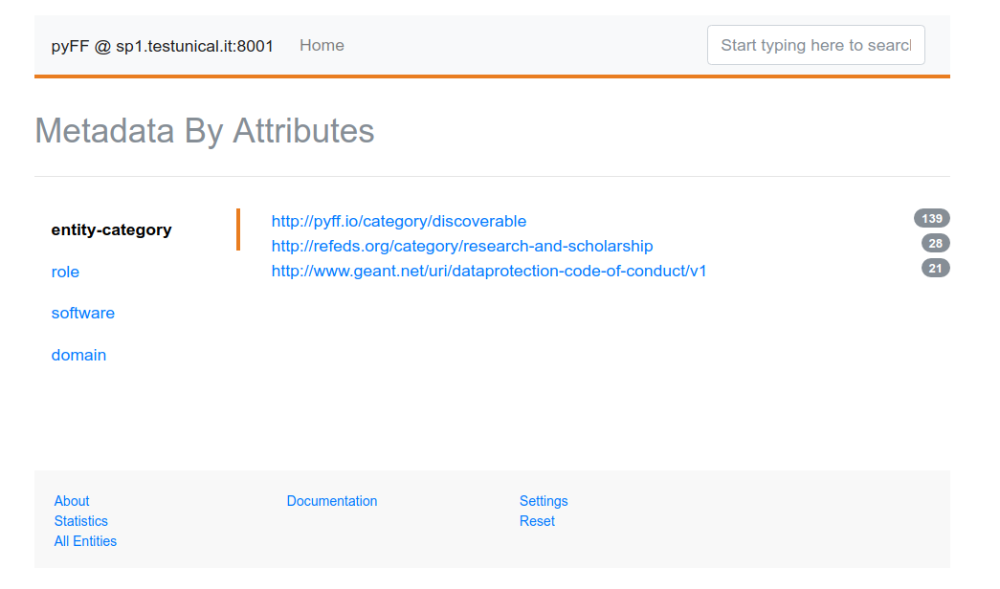

pyFF
----
[python Federation Feeder](http://pyff.io/)
[github](https://github.com/IdentityPython/pyFF)

pyFF is a omnicomprensive advanced Metadata appliance. 
It download, validate, aggregate, export one or many entities in xml format, in json format, as a querable [MDX service](https://datatracker.ietf.org/doc/draft-young-md-query-saml/), it will also give us a [DiscoveryService](http://docs.oasis-open.org/security/saml/Post2.0/sstc-saml-idp-discovery.pdf) and a user friendly web catalog with statistics and all the usefull informations as well, with an agile search engine... The first time I used it I wondered what I had done until then.

Please also rememeber that "MDX" is an acronym for MetaData eXchange and refers to a more general concept of which the "MDQ", acronym for Metadata Query Protocol, is just one component.

## Installation
````
pip install git+https://github.com/IdentityPython/pyFF.git
````

## First run

The following command will print in stdout all the pyFF's execution log, if you want to put it in a file just add `--log=pyff.log` after `--loglevel`.
It seems that pyff is sensible to arguments order, unfortunately it doesn't use arparse...
The `examples/` folder was taken from git repository.

````
pyffd -p pyff.pid -f -a --loglevel=DEBUG --dir=`pwd` -H 0.0.0.0 -P 8001 examples/big.fd
````

When it complete the downloads of all the metadata then exposes all the SAML entities in a _human navigable_ web catalog, this will permit us to test the DiscoveryService and see common stats.

Useful things that we need to know
1. pyFF uses by default a local sqllite db, it's automatically created in the working directory on run.

## how does it works
You need also to read:
- https://pythonhosted.org/pyFF/
- https://github.com/IdentityPython/pyFF

pyFF works with configuration files called _pipelines_, it exposes services and all its features depending of what we configure in those _pipelines_ files. The following example is used to validate and download to `./garr` folder all the configured metadata, then aggregate them in a sqllite database as a cache for better I/O performance.

`custom_examples/` contains some of the following examples.

*garr.xrd*
````
<?xml version="1.0"?>
<XRDS xmlns="http://docs.oasis-open.org/ns/xri/xrd-1.0">
  <XRD>
    <Link rel="urn:oasis:names:tc:SAML:2.0:metadata" href="http://md.idem.garr.it/metadata/idem-test-metadata-sha256.xml"/>
  </XRD>
  <XRD>
    <Link rel="urn:oasis:names:tc:SAML:2.0:metadata" href="http://md.idem.garr.it/metadata/idem-metadata-sha256.xml"/>
  </XRD>
</XRDS>
````

*garr.fd*
````
# load) download SAML Metadatas configured in these files
- load xrd ./garr-loaded.xrd:
  - custom_examples/garr.xrd
  
# select) this could, or not, specify a selection filter for EntityDescriptors in the metadata repository.
# it could be a XPATH selection to get for example only the IDP as: "http://mds.edugain.org!//md:EntityDescriptor[md:IDPSSODescriptor]"
# in this case it will take all of them
- select

# the folder where single entities will be stored
- store:
     directory: ./garr

# publish) causes the active document to be stored in an XML file.
- publish:
     output: ./garr-loaded.xml

# stats) prints out some information about the metadata repository.
- stats

# MDX server, see: https://pythonhosted.org/pyFF/examples.html#example-5-mdx
- when request:
    - select
    - pipe:
        - when accept application/xml:
             - xslt:
                 stylesheet: tidy.xsl
             - first
             - finalize:
                cacheDuration: PT5H
                validUntil: P10D
             - sign:
                 key: sign.key
                 cert: sign.crt
             - emit application/xml
             - break
        - when accept application/json:
             - xslt:
                 stylesheet: discojson.xsl
             - emit application/json:
             - break
````

## Advanced Topics
I think that pyFF would a be a real _stop-application_ for the followings:

1. Downloader, validatore avanzato per federare entità saml2
2. Store su RDBMS interrogabile da remoto
3. Metadata Query Resolver per entità interne alla home organization, in questo caso i nostri IDP non dovrebbero scaricare i metadatati degli SP ma interrogarli da remoto
4. DiscoveryService Integrato

Italian isn't so difficult to be read, isn't it?


## Playing MDX service

````
from saml2.mdstore import MetaDataMDX
mdx = MetaDataMDX("http://mdx.testunical.it:8001")
sso_loc = mdx.service("http://sp1.testunical.it:8000/saml2/metadata/", "spsso_descriptor", 'assertion_consumer_service')

mdx.certs("http://sp1.testunical.it:8000/saml2/metadata/", "spsso", use="signing")
mdx.certs("http://sp1.testunical.it:8000/saml2/metadata/", "spsso", use="encryption")

# get certs from idp
mdx.certs("http://idp1.testunical.it:9000/idp/metadata", "idpsso", use="encryption") 
````


## Fancy screenshot (what you will get)

When it start the only content available on its embedded webserver is a loading WebPage, this will persist until the metadata download and validation finishes, this will be also the only thing you will see if metadata could not be imported (404 on their page).


**Frontend**: Loading page during metadata importing procedure. 



**Home page**: All the entitities are now classified by categories, they could be also selected with an agile search engine. All the metadata information are now available. pyFF also exposes the pipelines used, the command used to start the server, in other words _everything_.

Additional resources
--------------------

- Using MDX with pySAML2, [read source](https://github.com/IdentityPython/pysaml2/blob/master/src/saml2/mdstore.py#L781)
- [Metadata Query Protocol](https://github.com/iay/md-query)
- pySAML2 MDQ usage, see:
  - https://github.com/IdentityPython/pysaml2/blob/master/docs/howto/config.rst#metadata
  - https://github.com/IdentityPython/pysaml2/issues/410
  - https://github.com/IdentityPython/pysaml2/issues/586
  - 
